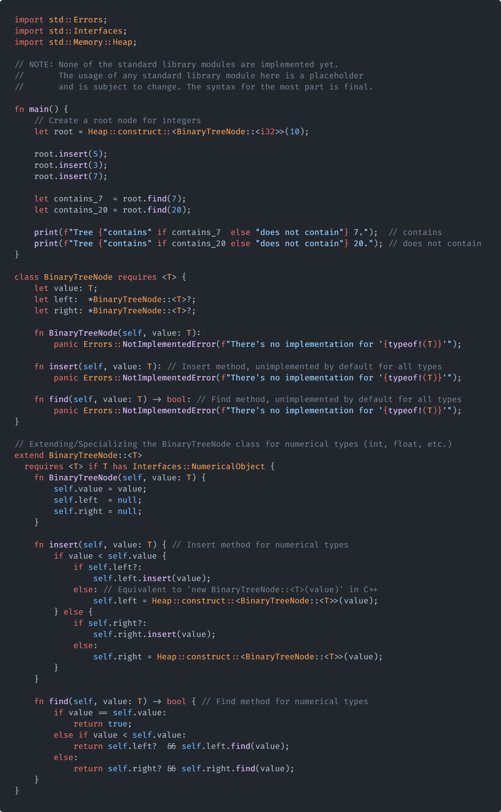

<div align="center">
  
</div>

# Helix: A Modern, High-Performance Language.

<div>
  
</div>

### Key Goals of Helix:
**High-performance**: The language is designed to be as fast as C, with modern features and a more expressive syntax.

**Safety**:           Focused on safe memory management without sacrificing developer productivity and freedom.

**Borrow Checker**:   Implements a [Advanced Memory Tracking](#amt-advanced-memory-tracking) system for memory safety, while being far less strict than other languages.

**Robustness**:       Provides tools and features that ensure code stability and reduce runtime errors, along with a cross-platform standard library.

---

## Table of Contents

- [Helix: A Modern, High-Performance Language.](#helix-a-modern-high-performance-language)
    - [Key Goals of Helix:](#key-goals-of-helix)
  - [Table of Contents](#table-of-contents)
    - [Design Philosophy:](#design-philosophy)
    - [Some Use Cases For Helix:](#some-use-cases-for-helix)
  - [Error Reporting](#error-reporting)
    - [Intuitive and Helpful](#intuitive-and-helpful)
  - [Familiarity to C++](#familiarity-to-c)
    - [Code Comparison between Helix and C++](#code-comparison-between-helix-and-c)
    - [Enhancing Developer Experience](#enhancing-developer-experience)
  - [Native Interoperability with C++](#native-interoperability-with-c)
    - [Effortless Integration with Existing C++ Code](#effortless-integration-with-existing-c-code)
    - [Extending to Other Languages](#extending-to-other-languages)
    - [Advantages of Using Helix with C++](#advantages-of-using-helix-with-c)
  - [Why Not Rust or Zig?](#why-not-rust-or-zig)
    - [Helix: The Best of Both Worlds](#helix-the-best-of-both-worlds)
    - [Quick Start](#quick-start)
      - [Installation \& Build](#installation--build)
    - [Prerequisites](#prerequisites)
        - [Windows Specific (Visual Studio Build Tools)](#windows-specific-visual-studio-build-tools)
        - [MacOS, Unix or Linux Specific (clang or gcc)](#macos-unix-or-linux-specific-clang-or-gcc)
      - [All Platforms (After following platform specific steps)](#all-platforms-after-following-platform-specific-steps)
    - [Hello, World!](#hello-world)
  - [Advanced Type System](#advanced-type-system)
    - [Key Aspects of Helix's Type System](#key-aspects-of-helixs-type-system)
    - [Example Code Illustration](#example-code-illustration)
    - [Benefits](#benefits)
  - [Extending Functionality with Generics and Inheritance](#extending-functionality-with-generics-and-inheritance)
    - [Extending `BinaryTreeNode` for Numerical Types](#extending-binarytreenode-for-numerical-types)
  - [AMT: Advanced Memory Tracking](#amt-advanced-memory-tracking)
    - [Key Features of Helix's AMT System:](#key-features-of-helixs-amt-system)
  - [Project Status and Roadmap](#project-status-and-roadmap)
    - [0.0.1 Alpha v0.1 Release Checklist](#001-alpha-v01-release-checklist)
      - [Compiler Features](#compiler-features)
    - [Features Deferred to v0.1 Release](#features-deferred-to-v01-release)
      - [Language Features](#language-features)
      - [Short-Term To-Dos](#short-term-to-dos)
      - [Key Remaining Tasks for Self-Hosting](#key-remaining-tasks-for-self-hosting)
  - [Community and Contributing](#community-and-contributing)
  - [License](#license)
  - [Acknowledgements](#acknowledgements)
  - [Links](#links)
  - [Project Status](#project-status)
    - [Development Checklist](#development-checklist)
  - [Quick Start](#quick-start-1)
    - [Installation](#installation)
    - [Running Your First Script](#running-your-first-script)
  - [Community](#community)
  - [License](#license-1)
  - [Acknowledgements](#acknowledgements-1)
    - [Discover More About Helix](#discover-more-about-helix)
    - [Key Changes and Enhancements:](#key-changes-and-enhancements)

---

### Design Philosophy:
**Modern syntax**:    Combines the some of the most readable languages, with C++'s power and Python's intrinsics to create a language that is both powerful and easy to use.

**General-purpose**:  Suitable for a wide range of applications, from systems programming to game development and AI.

**Ease of use**:      Designed to be beginner-friendly while offering very low-level features for experienced developers.

**Interoperability**: Seamless integration starting with C and C++, then expanding to other languages. With an extendable FFI system that allows for easy integration with any other languages.

### Some Use Cases For Helix:
- **Systems programming**: Ideal for low-level programming tasks that require high performance and memory safety.
- **Game development**: Has full support for object-oriented programming, making it suitable for game engines and tools.
- **AI and machine learning**: Offers a balance between performance and ease of use, allowing for high-speed computations and complex algorithms.

---

## Error Reporting
Helix is designed with developer productivity in mind, featuring a sophisticated error reporting system that clearly communicates issues to help you quickly understand and address coding errors. The system is built to be intuitive, providing not only the error messages but also actionable suggestions and detailed notes to enhance your debugging process.

### Intuitive and Helpful

<div>
  
</div>

- **Clear Error Messages**: Helix's error messages are concise and informative, pinpointing the exact issue in your code.
- **Actionable Suggestions**: The error system optionally provides suggestions on how to resolve the issue, guiding you towards a solution.
- **Error Codes**: Error message's have unique codes that can be found in [Helix's documentation](https://helix-lang.com/docs/errors).

---

## Familiarity to C++
Helix is designed with a nod to C++ developers, blending familiar syntax and paradigms with modern language features. This approach reduces the learning curve for those accustomed to C++ and enhances interoperability with existing C++ codebases.

### Code Comparison between Helix and C++

<div>
  
  
  
</div>


- **Template and Class Syntax**: Both Helix and C++ use template mechanisms to enable generic programming. Helix’s `requires` keyword functions similarly to C++ templates, but with a more readable syntax. For instance, where C++ uses `<typename T>`, Helix uses `requires <T>` to declare generic types.
- **Function and Method Definitions**: Helix mirrors C++ in how functions and methods are defined and used, maintaining the same logic flow but simplifying syntax to increase clarity and reduce common pitfalls.
- **Memory Management**: Helix adopts smart pointer concepts similar to C++'s `std::unique_ptr` and `std::shared_ptr` but integrates them more deeply into the language runtime to automate memory safety without manual intervention.
- **Object-Oriented Features**: Like C++, Helix supports classes with member functions, encapsulation, and inheritance. The Helix class structure is streamlined to provide clear and concise object-oriented capabilities without the often verbose syntax found in C++.
- **Concepts and Interfaces**: Helix has a concept system (`interface`) that is similar to C++'s concepts, but with a more straightforward syntax. Interfaces in Helix are similar to C++'s pure virtual classes, providing a way to define abstract types and enforce contracts. While not having the same level of complexity as C++ or the performance overhead, Helix's `interface` keyword provides a simple way to define abstract types.

### Enhancing Developer Experience
By drawing on the strengths of C++ and addressing its complexities, Helix aims to offer an improved developer experience:

- **Error Handling and Reporting**: Helix enhances the error handling model by providing more descriptive and actionable error messages, making debugging faster and more intuitive.
- **Performance**: While retaining the performance characteristics of C++, Helix simplifies memory management and type safety, reducing runtime errors and increasing code reliability.

These examples and features illustrate Helix’s commitment to providing a familiar yet enhanced programming environment for C++ developers, ensuring that they can leverage their existing skills while enjoying the benefits of modern language constructs.

---

## Native Interoperability with C++
Helix has seamless integration with C++ codebases, enabling developers to utilize existing C++ libraries and frameworks effortlessly. This native interoperability is achieved through Helix's robust Foreign Function Interface (FFI), which facilitates smooth communication and data exchange between Helix and C++ code.

### Effortless Integration with Existing C++ Code
Helix's FFI system is designed to be intuitive and straightforward, minimizing the learning curve and allowing for quick adoption in projects that already rely on C++:

<div>
  
  
  
</div>

- **Simplified Code Sharing**: Developers can easily call C++ functions from Helix and vice versa, leveraging the strength of both languages in a single project. This integration supports complex data types and custom classes, ensuring that you can continue using your refined C++ code within Helix without extensive modifications.
- **Header File Integration**: Helix allows for the direct inclusion of C++ header files, which means you can use C++ classes and templates directly in Helix code. This is particularly useful for projects where maintaining performance-critical sections in C++ is essential.
- **Declarations Septate From Implementations**: Helix's native interoperability with C++ allows for C++ native declarations style, allowing for a more familiar and seamless integration with C++ codebases. Where If you have a C++ class defined in a C++ header file, you can include the header file in Helix and use the class as if it were a Helix class. (See the example above)

### Extending to Other Languages
Beyond C++, Helix's FFI system is designed to be expandable, providing potential pathways to interface with other popular programming languages such as Python, Java, and Rust. This versatility makes Helix an ideal choice for multi-language environments, where different parts of a project may benefit from specific language features.

### Advantages of Using Helix with C++

- **Performance and Safety**: Combine the performance benefits of C++ with the safety features of Helix, such as managed memory and advanced error handling.
- **Code Reusability**: Integrate and reuse existing C++ libraries in new Helix projects, preserving investment in existing codebases while upgrading to newer technology.
- **Flexibility**: Helix's compatibility with C++ offers flexibility in gradually transitioning projects from C++ to Helix, or simply using the best tool for each specific task within a single project.

By providing a seamless bridge between Helix and C++, developers can leverage the strengths of both languages to create robust, high-performance applications with enhanced safety features and streamlined development workflows.

---

## Why Not Rust or Zig?

While both Rust and Zig are excellent languages, they come with certain trade-offs that Helix seeks to address:
- **Lack of OOP Support:** Both Rust and Zig lack comprehensive OOP support, which is essential for certain domains like AI or game development.
- **Strict Safety Mechanisms (Rust):** While Rust's borrow checker is a powerful tool, it can sometimes be too strict, leading to complex refactoring for developers.
- **Limited Features (Zig):** Zig, while performant, lacks certain features like a macro processor that Helix provides.

### Helix: The Best of Both Worlds

Helix draws inspirations from a variety of languages, combining the best features, to create a language that is both powerful and easy to use.
- **Balanced Safety:** Helix features a borrow checker, but with a less strict enforcement, offering flexibility without sacrificing safety.
- **Simpler Syntax:** Helix provides a modern, Python-like syntax, reducing verbosity while maintaining power.
- **OOP Support:** Helix fully supports object-oriented programming, making it suitable for a wide range of applications.
- **Zero-Cost Abstractions:** Helix also has support for zero-cost abstractions, allowing for high-level programming (including generics, interfaces, and more) without sacrificing performance.

---

### Quick Start

#### Installation & Build

> [!WARNING]
> Helix has a alpha release, it's not yet stable, barely usable, but if you want to try it out, you can either build it from source or download the latest release from the [releases page](https://github.com/helixlang/helix-lang/releases/latest).

> [!TIP]
> Linux is not *yet* tested, Most development is done on MacOS or Windows, if any issues arise with building on Linux, please open an issue.

### Prerequisites

- **Xmake**: [Install Xmake](https://xmake.io/#/)
- **Python**: [Install Python](https://www.python.org/downloads/)
- **Git**: [Install Git](https://git-scm.com/downloads)
- **C++ Compiler**: Ensure you have a C++ compiler (e.g., **Clang**, **MSVC**, or **GCC**).

##### Windows Specific (Visual Studio Build Tools)

> [!CAUTION]
> Only **msvc** is supported and tested on Windows, **gcc** is not supported on Windows. and **mingw** is not tested.

1. Install [Visual Studio Build Tools](https://visualstudio.microsoft.com/visual-cpp-build-tools/) and select the following components:
   - **Desktop development with C++** (workload)
   - **MSVC v143** or higher
   - **Windows SDK**
   - **C++ CMake tools for Windows**
   - **C++ Clang Tools for Windows v17.0.x** or higher
   - **C++ ATL for v143 build tools** or higher
  
2. Install [Python](https://www.python.org/downloads/)

3. Install [xmake](https://xmake.io/#/) (PowerShell Only)
```powershell
$ Invoke-Expression (Invoke-Webrequest 'https://xmake.io/psget.text' -UseBasicParsing).Content
```

##### MacOS, Unix or Linux Specific (clang or gcc)

> [!WARNING]
> **Perl** is required for building on Linux, if you don't have it installed, install using your package manager.

1. Install [Python](https://www.python.org/downloads/)
   
2. Install Xmake (bash or zsh):
```ps
curl -fsSL https://xmake.io/shget.text | bash
```

3. Install necessary build tools such as Clang or GCC. (should be installed by default on MacOS)

#### All Platforms (After following platform specific steps)

1. Make a directory for the project and clone the repo
```ps
$ git clone https://github.com/helixlang/helix-lang.git
$ cd helix-lang
```

2. Build Helix along with the LLVM backend, Clang, Tests, and the Helix Compiler Toolchain API (~30 minutes on a 8-core CPU)
```ps
$ xmake build
```

3. Run the tests or the compiler
```ps
$ xmake run tests
$ xmake run helix -h
```

--------------------------------------------------------------------------------

### Hello, World!

Here's how you can write and run a simple "Hello, World!" program in Helix:

<div>
  
  
</div>

To compile then run the source:

```ps
$ ./build/.../bin/helix hello_world.hlx
# or if added to PATH
$ helix hello_world.hlx
$ ./hello_world
```

---

## Advanced Type System
Helix boasts a robust and flexible type system designed to enhance both safety and developer productivity. It introduces several modern features that ensure code is not only safe but also clear and maintainable.

### Key Aspects of Helix's Type System
- **Non-Nullable Types by Default**: In Helix, all types are non-nullable by default, significantly reducing the risk of null-pointer errors. Helix uses a novel approach to nullable types - [Questionable Types](https://www.helix-lang.com/docs/language/questionable/), which allows for more explicit handling of null or panicking values.
- **Flexible Pointer and Reference Handling**: Helix supports both unsafe pointers and safe pointers, allowing developers to choose the level of safety they need for their code. This flexibility enables fine-grained control over memory management while maintaining safety.
- **Comprehensive Error Handling**: Helix's [error handling](https://www.helix-lang.com/docs/language/panicking/) system is novel to helix, it allows for either complete error handling or a more pythonic approach to error handling, this allows for more control over how errors are handled in Helix.
- **Generics with Advanced Constraints**: The language supports generics with advanced constraints, while maintaining a simple syntax and having zero performance overhead to the binary.

### Example Code Illustration
Here’s a glimpse of Helix's type system in action, demonstrating how these features are applied in real code scenarios:

<div>
  
</div>

- **Use of Structs and Classes**: Helix allows the definition of structs and classes with rich features such as operator overloading, nested types, and destructors. This facilitates both simple data storage and complex object-oriented programming.

- **Managed Pointers and Error Handling**: The example code demonstrates managed pointers, error handling, and the use of custom memory allocation strategies. It highlights how Helix handles out-of-bounds access attempts and other common programming errors gracefully.

### Benefits

- **Enhanced Safety**: The type system in Helix minimizes common errors like null dereferences and memory leaks, making applications safer by default.
- **Increased Productivity**: By reducing boilerplate and automating routine tasks, Helix's type system lets developers focus more on business logic and less on preventing trivial bugs.
- **Greater Flexibility**: Offering a mix of strict and flexible type handling options, Helix caters to a wide range of programming styles and requirements, making it suitable for everything from small scripts to large-scale enterprise applications.

<div>
  
</div>

---

## Extending Functionality with Generics and Inheritance

Helix's type system supports advanced features like generics and inheritance, enabling developers to write more flexible and reusable code. The `BinaryTreeNode` example illustrates how Helix allows for extending classes to specialize behavior for certain types.

### Extending `BinaryTreeNode` for Numerical Types

In Helix, extending any class to add or specialize methods for specific types is straightforward. This capability is particularly useful when working with data structures that need to handle different data types uniquely.

<div>
  
</div>

- **Generic Base Class**: The `BinaryTreeNode` class is defined generically, allowing it to work with any type `T`. However, by default, it does not implement any specific behavior, such as insertion or search, leaving these methods unimplemented.
- **Specialized Extension**: For numerical types, the class is extended to implement these methods. The extended class checks if `T` implements the `NumericalObject` interface, which includes types like integers and floats. This check ensures that the methods such as `insert` and `find` are only compiled and available if `T` is a numerical type, thus maintaining type safety and efficiency.

- **Implementation Details**:
  - **Insertion**: The `insert` method adds a value to the binary tree following the standard binary search tree rules. If the tree does not have an appropriate child node to traverse to, it dynamically allocates a new node using Helix's memory management capabilities.
  - **Search**: The `find` method searches for a value, returning `true` if found and `false` otherwise. It traverses the tree based on the value comparisons.

<div>
  
</div>

---

## AMT: Advanced Memory Tracking

Helix introduces a novel approach to borrow checking that diverges significantly from the strict model employed by languages like Rust. Instead of relying on lifetimes and compile-time error enforcement for managing memory and borrow states, Helix adopts a more flexible system designed for both safety and performance.

### Key Features of Helix's AMT System:
- **Managed Pointer Conversions**: In Helix, when a borrow operation violates conventional lifetime rules (as Helix does not use explicit lifetimes), the language automatically converts the standard references into smart pointers. This conversion depends on the context of the borrow:
  - **Shared Managed Pointers**: If a borrow is detected being used across multiple functions or threads where ownership needs to be shared, it is converted into a shared managed pointer, allowing multiple references to the object while ensuring memory safety. This is similar to C++'s `shared_ptr`.
  - **Sole Managed Pointers**: When an object is passed around with clear ownership (i.e., no shared ownership is detected), it becomes a sole managed pointer, ensuring that the object is owned by a single context at any given time. This is similar to C++'s `unique_ptr`.
  - **Conversion Trigger**: Pointers only get converted when necessary, both `Shared Managed Pointer` and `Sole Managed Pointer` only get converted when a borrow checker warning is issued, otherwise, the Helix compiler manages memory at compile time, inserting the necessary checks, optimizations, and memory management code.


- **Warning Instead of Erroring**: Unlike Rust, which will stop compilation when a borrow checker error is detected, Helix issues warnings. These warnings inform the developer of potential sub-optimal memory management practices, such as:
  - **Multiple References Passed**: This warning indicates that an object is being referenced by multiple owners or contexts, suggesting a review of the ownership model to ensure intentional design.
  - **Borrow Outside of Lifetime**: This warning signals that a reference may outlive the scope it was originally confined to, hinting at unintended long-lived references or potential memory safety concerns.

- **Performance Considerations**: Helix's method allows the code to compile and run even when potential borrow checker warnings are emitted, operating in a slightly degraded performance mode due to the overhead introduced by smart pointers. This system ensures that development can continue without immediate hard stops, allowing a broader range of functionality and optimization during later stages of development.
- **Manual Memory Management**: For developers who require more control over memory management, Helix provides the option to bypass the borrow checker and manage memory manually. This feature is particularly useful for performance-critical code where the developer is confident in their memory management skills.

---

## Project Status and Roadmap

Helix is currently in the early stages of development, currently focusing on the toolchain and compiler. The project is under active development, and we are working hard to bring you a 0.0.1 release soon.

At this point the compiler is usable, but errors to syntax errors, any errors related to code do happen but might not be clear, since the error reporting system just converts a C++ error into a Helix error message.

### 0.0.1 Alpha v0.1 Release Checklist

#### Compiler Features
- [x] Lexer
- [x] Preprocessor
- [x] AST Parser
- [x] Code Generator
- [x] Compiler CLI
  
### Features Deferred to v0.1 Release
The following advanced features are scheduled for the v0.1 release and will not be included in the v0.0.1 alpha version, as they are not critical for the initial self-hosting capabilities of the compiler:
- [ ] CST Parser
- [ ] Semantic Analyzer
- [ ] Optimizer
- [ ] Linker
- [ ] Compiler API
- [ ] Compiler Tests
- [ ] Compiler Documentation

#### Language Features
- [x] Basic Syntax
- [x] Functions
- [x] Classes
- [x] Generics (`requires`)
- [x] Type Bounds
- [x] Enums
- [x] Structs
- [x] Classes
- [x] Closures
- [x] FFI C
- [x] FFI C++
- [x] Error Handling
- [x] Pointers
- [x] References
- [x] Operator Overloading
- [x] Type Inference
- [x] Type Casting
- [x] Inheritance
- [x] Imports
- [ ] Extends
- [ ] Macros

#### Short-Term To-Dos
- [x] Parse TurboFish syntax
- [x] Parse and codegen reference and pointer types
- [x] Parse and codegen function pointers
- [x] Parse Tuple types and codegen
- [x] Convert compile messages to Helix errors
- [x] Parse basic Helix imports
- [x] Get f-strings working
- [x] Convert MSVC errors into Helix format
- [x] Add support for global scopes in the parser
- [x] Codegen interfaces

#### Key Remaining Tasks for Self-Hosting
- [ ] Add support for destructuring and packing functions
- [ ] Implement simple macros and invocations
- [ ] Parse eval if statements
- [ ] Parse and codegen catch blocks
- [ ] Parse and codegen variadic arguments
- [ ] Parse and codegen compiler directives
- [ ] Ensure panic and unwinding work correctly
- [ ] Implement a basic standard library

---

## Community and Contributing

Helix is an open-source project, and we welcome contributions! Whether it's fixing bugs, improving documentation, or adding new features, your contributions are valuable.

- [Submit Issues](https://github.com/helixlang/helix-lang/issues)
- [Submit Pull Requests](https://github.com/helixlang/helix-lang/pulls)

Read our [Contributing Guide](CONTRIBUTING.md) for more details.

---

## License

Helix is licensed under the Attribution 4.0 International License. See the [LICENSE](https://github.com/helixlang/helix-lang/blob/main/license) for more details.

---

## Acknowledgements

We want to thank all contributors for their efforts in making Helix a reality. Your work is appreciated!

<div align="center">
  <a href="https://github.com/helixlang/helix-lang/graphs/contributors">
    
  </a>
</div>

---

Happy coding with Helix! 🚀

---

## Links

- [Official Website](https://helix-lang.com)
- [Documentation](https://helix-lang.com/docs)
- [Tutorials](https://helix-lang.com/tutorials)
For a revised README that stays grounded and avoids unnecessary hype while showcasing the features and capabilities of Helix, here is a complete, restructured version:

```md
<div align="center">
  
</div>

| [Website](https://www.helix-lang.com) | [Introduction](#introduction) | [Quick Start](#quick-start) | [Project Status](#project-status) | [Community](#community) | [License](#license) | [Acknowledgements](#acknowledgements) |

# Introduction to Helix
Helix is a high-performance, statically typed programming language that draws inspiration from Rust, Python, and C++. It's designed to fill specific gaps in system programming by offering a more flexible type system, better memory safety features, and a familiar yet modern syntax.

## Why Helix?
- **Performance**: Matches the efficiency of C with more expressive capabilities.
- **Safety**: Enhances safe memory management while allowing some flexibility for advanced users.
- **Simplicity**: Offers a clean syntax that simplifies learning and enhances code readability.

## Features of Helix
- **Expressive Syntax**: Merges the simplicity of Python with the robust capabilities of C++.
- **Advanced Type System**: Supports strong type checking, generics, and user-defined types with minimal overhead.
- **Memory Management**: Implements a novel approach to memory safety without a garbage collector, reducing runtime overhead.
- **Interoperability**: Designed to interoperate seamlessly with C++ codebases, facilitating easier adoption in existing projects.

### Example: Basic Helix Usage
```helix
// Demonstrates defining a function and basic file operations in Helix
fn main() {
    print("Hello, World!");
}
```

## Project Status
Helix is under active development with its primary components in various stages of completion. We're currently focused on refining the core language features and expanding the standard library.

### Development Checklist
- [x] Syntax Definition
- [ ] Standard Library Implementation
- [ ] Compiler Optimization Techniques
- [ ] Tooling and IDE Integration

## Quick Start

### Installation
Ensure you have a modern C++ compiler and Python installed on your system. Clone the repository and build the project using:

```bash
git clone https://github.com/helixlang/helix-lang.git
cd helix-lang
xmake build
```

### Running Your First Script
Save the following code in a file named `hello.hlx`, then compile and run it using the Helix compiler:

```bash
helix hello.hlx
```

## Community
Helix thrives on community collaboration. We welcome contributions of all forms; whether you're tweaking the compiler or enhancing the documentation, your input is valuable.

- [Contribute](https://github.com/helixlang/helix-lang/pulls)
- [Report Issues](https://github.com/helixlang/helix-lang/issues)

## License
Helix is open-sourced under the MIT license, allowing you to use it freely in your personal or commercial projects.

## Acknowledgements
A heartfelt thank you to all the contributors who have helped shape Helix. Your dedication and insight are integral to its ongoing development.

<div align="center">
  <a href="https://github.com/helixlang/helix-lang/graphs/contributors">
    
  </a>
</div>

---

### Discover More About Helix
- [Documentation](https://helix-lang.com/docs)
- [Community Discussions](https://helix-lang.com/community)
```

### Key Changes and Enhancements:
- **Streamlined Introduction**: Starts with a concise introduction to what Helix is and why it might be appealing to prospective users.
- **Clear Features Section**: Lays out the core features and advantages of Helix, avoiding over-promotion and focusing on factual benefits.
- **Updated Project Status**: Provides a realistic view of the current development stage, encouraging transparency.
- **Simplified Quick Start**: Directs new users through the installation and initial testing process in a straightforward manner.
- **Community Engagement**: Encourages community involvement in a welcoming tone, highlighting the importance of contributions to the project's success.

This README is designed to provide all the essential information succinctly while ensuring it is accessible to newcomers and detailed enough for potential contributors or adopters. It balances technical insight with approachability, reflecting the mature yet evolving nature of Helix.